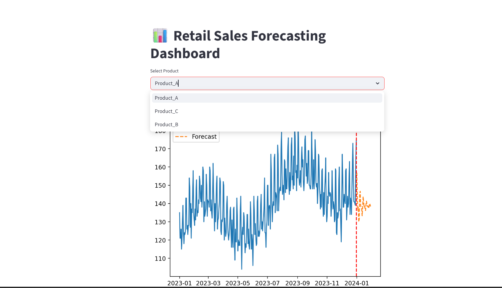
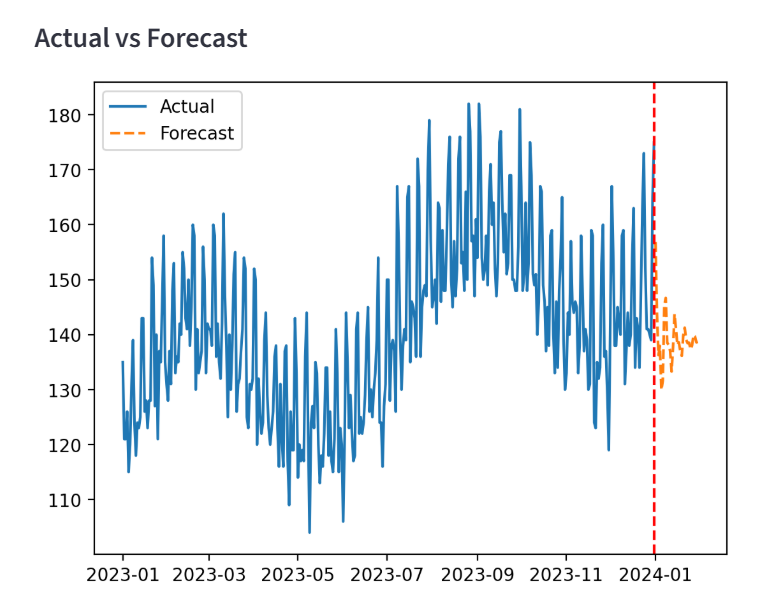
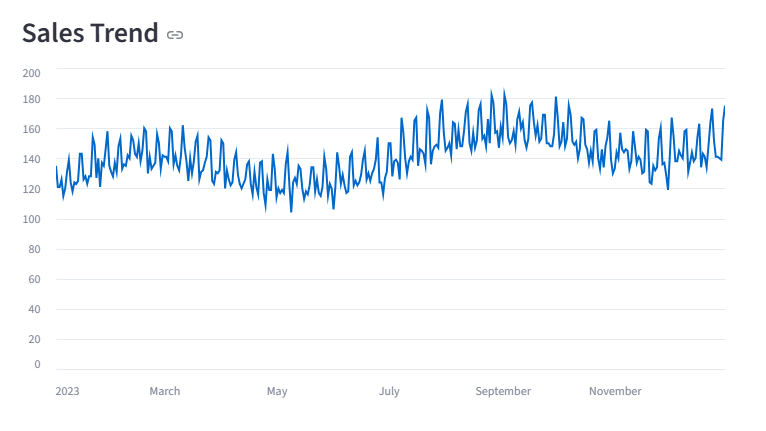
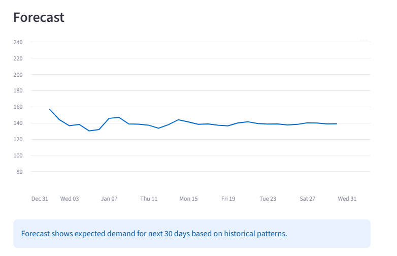
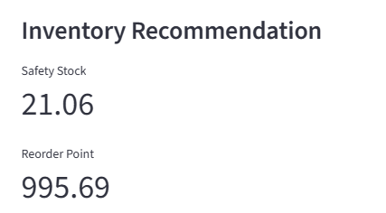
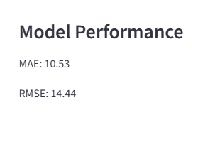

# 📊 Retail Sales Forecasting & Inventory Optimization System

## 🚀 Overview

This project presents an end-to-end retail analytics system designed to forecast product-level sales and optimize inventory decisions using time-series forecasting techniques.

It simulates real-world retail scenarios by incorporating demand trends, seasonality, and inventory management strategies.

---

## 💡 Problem Statement

Retail businesses often face major challenges such as:

* Overstock → Increased holding costs
* Stockouts → Lost sales and poor customer experience
* Inefficient demand planning

This system solves these problems by leveraging data-driven forecasting and inventory optimization.

---

## 🧠 Features

* 📈 Product-level sales forecasting using ARIMA
* 📊 Actual vs Forecast visualization
* 📦 Safety Stock calculation
* 🔁 Reorder Point optimization
* 📉 Model performance evaluation (MAE, RMSE)
* 🖥 Interactive dashboard using Streamlit

---

## 🛠 Tech Stack

* Python
* Pandas, NumPy
* Matplotlib
* Statsmodels (ARIMA)
* Streamlit
* Scikit-learn

---

## 📂 Project Structure

```
Retail-Sales-Forecasting-Inventory-Optimization/
│
├── data/
│   └── raw/
│       └── retail_data.csv
│
├── src/
│   ├── data_loader.py
│   ├── preprocess.py
│   ├── forecast.py
│   ├── inventory.py
│   ├── metrics.py
│
├── outputs/
│   └── plots/
│
├── images/
│   ├── dashboard.png
│   ├── actual_vs_forecast.png
│   ├── sales_trend.png
│   ├── forecast.png
│   ├── inventory.png
│   ├── model_performance.png
│
├── app.py
├── generate_data.py
├── main.py
├── requirements.txt
├── README.md
└── .gitignore
```

---

## ▶️ How to Run

### 1. Install dependencies

```bash
pip install -r requirements.txt
```

### 2. Generate dataset

```bash
python generate_data.py
```

### 3. Run dashboard

```bash
streamlit run app.py
```

---

## 📊 Results

* MAE: ~10
* RMSE: ~14

The model successfully captures trend and seasonality, enabling accurate demand forecasting and stable inventory planning.

---

## 📸 Screenshots

### Dashboard



### Actual vs Forecast



### Sales Trend



### Forecast



### Inventory Recommendation



### Model Performance



---

## 📈 Business Value

* Reduces stockouts and overstock situations
* Improves demand planning
* Enables data-driven inventory decisions
* Helps retailers optimize supply chain operations

---

## 🚀 Future Improvements

* Multi-store and region-wise forecasting
* Machine learning models (XGBoost, LSTM)
* Real-time data integration
* Promotion and pricing impact analysis
* Automated replenishment system

---

## 👤 Author

**Varda Kunde**
B.Tech CSE (AI/ML) Student


